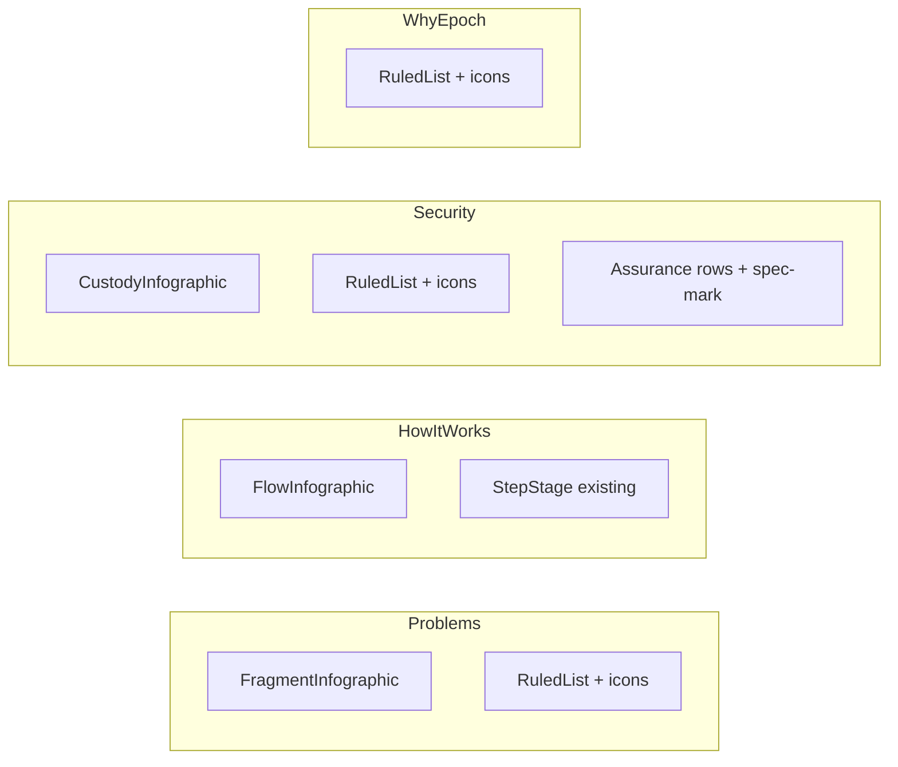

# Wire icons and infographics into key sections

## Current gap

[`components/Infographics.tsx`](../components/Infographics.tsx) already defines `FragmentInfographic`, `CustodyInfographic`, `FlowInfographic`, and step assets. [`components/Icon.tsx`](../components/Icon.tsx) already has matching marks (`nodes`, `key`, `clock`, `fail`, etc.) and is imported by `Capabilities.tsx`; the infographics themselves are what nothing imports yet.

Sections now use text-only [`RuledList`](../components/RuledList.tsx) / datasheet rows:

- **Why this is hard** — header + ruled rows only
- **Security & custody** — header + ruled pillars + Assurance sheet (no marks)
- **Why Epoch** — ruled rows only
- **How it works** — already has [`StepStage`](../components/StepStage.tsx) (outcome-record state machine); no path diagram

Compliance stays as-is (intentionally dropped decorative tiles).

## Approach

Keep the ruled-register language. Add two visual layers:

1. **Section diagram** beside/under the header (one infographic per section)
2. **Row marks** — small `icon-tile` on each ruled/assurance row (supporting mark, not a card)

## Implementation

### 1. Extend `RuledList` for optional icons

In [`components/RuledList.tsx`](../components/RuledList.tsx):

- Add optional `icon?: IconName` on `RuledRow`
- Render an `icon-tile` in the title column when present (keeps index + title + body geometry)

### 2. Why this is hard — [`components/Problems.tsx`](../components/Problems.tsx)

- Header + `FragmentInfographic` in a two-column header band on `lg+`
- Row icons: `nodes`, `cost`, `lockIn`

### 3. Security & Assurance — [`components/Security.tsx`](../components/Security.tsx)

- Header + `CustodyInfographic` in the same header-band pattern
- Pillar icons: `key`, `clock`, `fail`
- Assurance `Row`: optional `icon` → `.spec-mark` beside the label (`key`, `route`, `policy`, `audit`, `building`, `status`, `mail`, `pack` as applicable)

### 4. How it works — [`components/HowItWorks.tsx`](../components/HowItWorks.tsx)

- Keep `StepStage` as the primary scrubbed object
- Add `FlowInfographic` above it in the sticky left column (static path summary; stage still carries the step narrative)
- Add step icons beside each step label on the right (`intent`, `route`, `settle`)

### 5. Why Epoch — [`components/WhyEpoch.tsx`](../components/WhyEpoch.tsx)

- Row icons: `click`, `bank`, `plug`, `boxCheck`
- Optional `label` tags already supported by `RuledList` (`UX`, `Institutional`, etc.)

### 6. CSS

Reuse existing `.diagram`, `.icon-tile`, `.spec-mark` in [`app/globals.css`](../app/globals.css). Only add a small header-band utility if needed for `items-end` diagram alignment—no new card language.

## Implementation notes

- The `RuledList` title column is fixed at `minmax(0,19rem)`. The `icon-tile` must sit inline with the title via flex with `flex-shrink: 0` so long titles wrap rather than squeeze.
- `RuledList.tsx` gets a top-of-file `import type { IconName }` from `./Icon` (workspace rule: no inline imports).
- HowItWorks sticky column: adding `FlowInfographic` above `StepStage` grows the stack; keep it compact and verify sticky pinning still fits the viewport, falling back to `hidden lg:block` on the diagram if it overflows.
- Motion layer needs no changes: icons inside `[data-row]` inherit the existing clip-reveal; diagrams render static by design.
- `FlowInfographic` stays static (`active` default); wiring it to the ScrollTrigger progress is out of scope.

## Out of scope

- Replacing `StepStage` with the older per-step asset swap
- Reintroducing icon tiles on Compliance
- Scrubbing `FlowInfographic.active` against the HowItWorks ScrollTrigger

Raster plates from `public/` (`epoch-solution-N.png`, `why-epoch-N.png`) are wired in as framed `ImagePlate` galleries in HowItWorks and WhyEpoch, so a bitmap asset path is deliberately in scope this round.

## Todos

1. Add optional icon to RuledList rows
2. Wire Fragment/Custody infographics + row icons into Problems and Security/Assurance
3. Add FlowInfographic + step icons to HowItWorks; icons/tags on WhyEpoch
